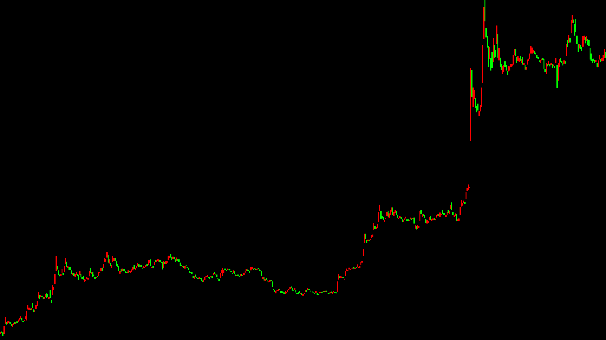
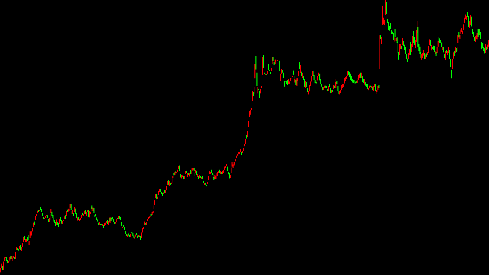

# Trade Aggregation
Convert trade data into candles using different forms of aggregation.
The Candles provide more detailed statistics than the usual OHLCV candles.
Additional statistics inlcude:
- number of trades
- trade direction ratio ( num_buys / num_trades )
- volume direction ratio ( buyVolume / totalVolume )
- weighted average price ( using abs(size) as weight)

This Aggregation package allows for the creation of highly sophisticated algorithm and ML models.
It enables a clear view of the market state without using arbitrary time aggregation.

### Time Aggregation:
Creates a candle every n seconds.
This method of aggregating trades has a long history mostly due to humans interacting with the market with a perception of time.
This is however not how the market works (especially 24/7 crypto markets).
The markets doesnt care about the time, only about price and volume.

### Volume Aggregation:
Creates a candle every n traded contracts ( trade size)
Price moves occur whenever and aggressive trader places a market order with a given size.
The more size is being traded the more likely a stronger move will be.
This is more natural way to view the market and provides many advantages over time aggregation such as more well behaved volatility.
In this mode of Aggregation, candles will be printed dynamically and will print more candles in times of higher volume / volatility,
therefore providing the trader which an automatically scaling view, just like as if he would switch time periods, but way better.

### Market Energy Aggregation:
Creates candles using the aggregation function 
``
sqrt(abs(size) * abs(return))
``
I named the function as i did not find anyone who has used this aggregation method before.
This is the most sophisticated aggregation method and captures the market energy well, 
creating a timeseries which is well behaved and does not suffer as much as time aggregated candles from volatility.

### Images
Now let's analyze the behaviour of the aggregation methods. First we will take a look at 1 hour time aggregated
candles (513 to be exact). It was created on XBTM20 contracts on Bitmex and take the last 1 million trades for aggregation.
This is what it looks like using my rudimentary [candlestick render](https://MathisWellmann/go_plot_candlestick)
Candle color is determined by VolumeDirectionRatio:
- VolumeDirectionRatio > 0.5 -> Green Candle
- VolumeDirectionRatio < 0.5 -> Red Candle
This gives another layer of information, but may prove otherwise as well.

Now compare it with trade aggregation based on volume and the same underlying data. 
The candles are 513 exactly as well which was achieved by computing the correct volume threshold parameter of the AggVolume function.
Volume Threshold has been set to 4290000, which means create on candle every 4290000 USD worth of bitcoin contracts being traded.
Here is what it looks like:

Not surprisingly (hopefully) is is clear that this shows a much more well behaved chart. 
The individual waves are cleary visible without any magic involved.
The sharp 3 wave up-move seen in the later part of the time aggregated candles are now much more relaxed and flow naturally.
The volume graph on this would be flat.
Now let' take a look at another formula that aims to capture the market energy optimally.
To the best of my knowledge is this the first time a formula like this has been used to aggregate trade data.
 
### Installation:
``
go get github.com/MathisWellmann/go_trade_aggregation
``

### How To Use:
First load your desired trades into []*Trade. Note that if trade is sell, then size is negative. 
This reduces memory usage over storing that info in string as it is only one bit.
See [example](example) folder and tests for more details.

### TODOs:
- Add volume bars to bottom of charts
- Helper functions for converting time period to other threshold values so that the same number of candles can be
returned over all aggregation methods without tuning parameter manually.
- Analysis paper of observed behaviour with different aggregation methods